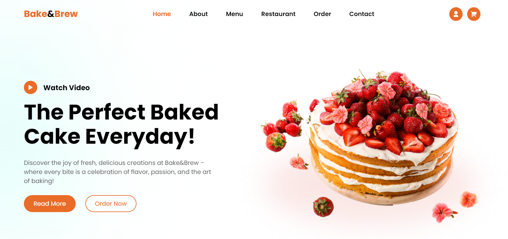

<h1 align="center">🍰 Bake&Brew — Modern Bakery Website ☕</h1>

  

  <em>Elegant, delicious, and handcrafted – a modern UI website for your favorite bakery experience.</em>

## 🚀 Live Demo

🌐 [Click here to explore the website](https://bakenbrew.netlify.app)

---

## ✨ Features

- 🍞 Beautifully responsive UI
- 🧁 Product showcase with images (cakes, muffins, cookies, etc.)
- 🎂 Hover effects and transitions
- 🔄 Loading animation
- 📱 Mobile-friendly layout

---

## 🧰 Tech Stack

- **HTML5** – Structure
- **CSS3** – Styling & Layout
- **JavaScript** – Interactivity

---

## 🗂️ Folder Structure
<pre>
BAKE&BREW/
├── images/ # All image assets
├── index.html # Main HTML file
├── style.css # Stylesheet
├── script.js # JavaScript logic
└── README.md # Project overview
</pre>

---

## 📩 Contact

📧 Email: [maneabhishek2003@gmail.com](mailto:maneabhishek2003@gmail.com)

🔗 Socials:  
[LinkedIn](https://www.linkedin.com/in/abhishek-mane-9491422b8) | [GitHub](https://github.com/AbhishekMane06)

---

> © 2025 Abhishek Mane — Designed with ❤️ for the web.
